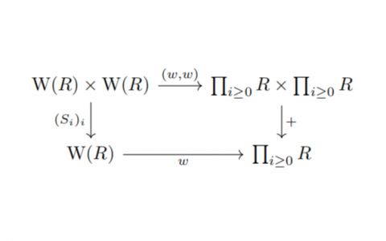

    

# Epimorphism Modern

A huge addon for GregTechCEu Modern.

<h1 align="center">
    
    
</h1>

## 🚧 Project Archived

> **This mod is no longer maintained.**
>
> Development has been discontinued and this repository is archived.  
> No further updates or support will be provided.

## Desc

- [ ] Combat to magic mods.  
- [ ] New machines.  
- [ ] New features.

and more more...  
This mod is make by our modpack project then we create this new addon mod.
